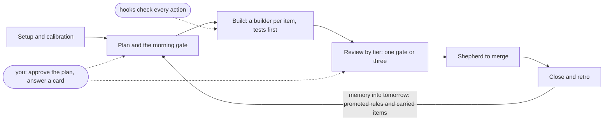

<p align="center"><picture>
    <source media="(prefers-color-scheme: dark)" srcset="docs/site/assets/hero-dark.svg">
    <source media="(prefers-color-scheme: light)" srcset="docs/site/assets/hero-light.svg">
    
</picture></p>

<h1 align="center">WUWEI 无为</h1>

<p align="center"><strong>Autonomous delivery where the safe path is the default one.</strong></p>

<p align="center">无为 (wuwei, said woo-way) means "effortless action": work gets done without forcing it.</p>

<p align="center"><a href="docs/site/index.md">Documentation</a> · <a href="docs/site/concepts.md">Concepts</a> · <a href="docs/site/configuration.md">Configuration</a> · <a href="LICENSE">Apache 2.0</a></p>

WUWEI runs your coding agents the way a careful engineering team works. The day is planned
and ranked, and you approve the plan each morning. Every change is reviewed by an agent that
did not write it, merges follow your merge policy, and the day ends with a retro that
proposes changes to the rules.

## What WUWEI is and is not

WUWEI is a Claude Code plugin. It runs a chartered team of agents across your repositories, keeps workspace memory under `.wuwei/`, and works through `gh` for the code host, with tracker and chat as optional adapters.

WUWEI is not a hosted service, a tracker, a chat system, or a replacement for your repository rules.

## What ships today

- The day loop: `/wuwei plan`, the morning [gate](docs/site/concepts.md#gate), builders, gates, PR and close ([daily path](docs/site/daily.md)).
- Guards at action time, a signed release and integrity checks ([security](docs/site/security.md)).
- Review [tiers](docs/site/concepts.md#tier): one reviewer for a docs-only change, three gates for code or a [trust surface](docs/site/concepts.md#trust-surface) ([review tiers](docs/site/concepts.md#review-tiers)).
- Remote operation from the phone through Remote Control and a Slack owner DM ([remote operation](docs/site/remote.md)).
- The cockpit: a day board on loopback and inline in Claude Code ([cockpit and board](docs/site/concepts.md#cockpit-and-board)).
- Calibration and the owner interview ([calibration](docs/site/configuration.md#calibration)).
- Setup in one command: it finds the repositories, calibrates them, asks the owner interview and applies one proposal after its [digest](docs/site/concepts.md#digest) ([setup](docs/site/daily.md#2-configure)).
- Doctor: install, host, workspace, gate, day and guard problems, each with its fix ([doctor](docs/site/reference.md#doctor)).
- Security posture: observe, guarded or strict per area, with floors no setting lowers. The MCP registry gate warns by default and blocks on a critical finding or a check that could not run ([security posture](docs/site/security.md#security-posture)).
- The heartbeat: probes that prove the system behaves, with a dead-man ping ([heartbeat](docs/site/reference.md#heartbeat)).
- The path: `bin/wuwei next` returns the exact next action for each step of the day, and Claude walks it ([what the session knows](docs/site/agent.md)).
- Cruise mode: the CLI answers clear two-way decisions of a class at its level, tells you, and lets you undo for an hour. Reversals spend the class's error budget, and a spent budget lowers the class until the window refills. Agreement raises it on your card. A target the workspace has never touched asks you once, and a class that keeps being more sure than right runs at most L1. A raise runs in shadow first and goes live only on your card ([cruise answers](docs/site/daily.md#cruise-answers), [design spec](docs/specs/2026-09-24-wuwei-design.md) section 5.8.1).
- One register of people, channels and tools: `bin/wuwei who` reads it ([people, channels and tools](docs/site/configuration.md#people-channels-and-tools)).
- The DORA four keys: `bin/wuwei dora` prints lead time, deployment frequency, change failure rate and time to restore, each with its source or the reason it has no reading yet ([DORA keys](docs/site/concepts.md#dora-keys)).

## How it works

You start the morning with `/wuwei:wuwei-plan`. The planner [seat](docs/site/concepts.md#seat) ranks
the work against your goals, and one Ask card asks you to approve today's plan ([daily path](docs/site/daily.md)).

Then you get on with your own work. A builder writes each change in its own worktree, tests
first, and reviewers that did not write it check it. A [shepherd](docs/site/concepts.md#shepherd)
follows each pull request to merge, and the status line shows you where the day stands.

When a seat needs you, the question arrives as a decision with a recommendation, in the
session or as a DM on your phone. You answer it, and the day goes on without you watching.

In the evening you close the day. `/wuwei:wuwei-report` runs the retro, and the
[steward](docs/site/concepts.md#steward) proposes rule changes that you promote or drop. All
day the hooks make the safe path the default one, so you have nothing special to remember.

## The basic workflow

In words: setup, plan, build, review, shepherd to merge, then close with a retro that feeds tomorrow.

Setup runs in a [host terminal](docs/site/concepts.md#host-terminal), [carried](docs/site/concepts.md#carry) items open the next plan, and the hooks warn or block by your posture ([concepts](docs/site/concepts.md)).

## When something goes wrong

- `bin/wuwei why last refusal` names the guard, the rule and the fix for the last refused call.
- `bin/wuwei doctor --fix` checks the install, host, workspace and day, and applies the deterministic fixes after one confirmation.
- `bin/wuwei next` prints the next step for the day.
- `bin/wuwei shadow report` lists what the guards would have refused in the observe posture.
- The day's records are under `.wuwei/days/<date>/`: state, events and decisions ([recovery](docs/site/recovery.md)).

## What is inside

- Skills: [wuwei-plan](skills/wuwei-plan/SKILL.md), [wuwei-report](skills/wuwei-report/SKILL.md), [wuwei-retro](skills/wuwei-retro/SKILL.md) and [wuwei-consolidate](skills/wuwei-consolidate/SKILL.md).
- Seats, each with its charter: [planner](charters/planner.md), [lead](charters/lead.md), [builder](charters/builder.md), [shepherd](charters/shepherd.md), [steward](charters/steward.md) and four [sentinels](docs/site/concepts.md#sentinel): [architecture](charters/sentinel-arch.md), [goal](charters/sentinel-goal.md), [quality](charters/sentinel-quality.md) and [security](charters/sentinel-security.md).
- Guards by hook event: PreToolUse checks a call before it runs (seat launches, commits, pushes, pull requests, merges, state writes). PostToolUse traces each call and lints gate verdicts; SubagentStop checks each seat's retro note. SessionStart prints the memory payload; PreCompact flushes state and events; Stop checks overdue PR actions and, at close, the retro.
- Adapters by port ([adapters and ports](docs/site/adapters.md)); the [documentation site](docs/site/index.md) covers the rest:

| Port | Shipped |
|---|---|
| calendar | ics, none |
| chat | none, slack |
| checks | local, none |
| code_host | github, none |
| docs | confluence, markdown, none, notion |
| editor | local |
| host | local, none |
| inbound | none, slack |
| integrity | none, ssh |
| redactor | builtin |
| review_bot | greptile, none |
| runtime | claude, codex, none |
| scanner | none, ziran |
| tracker | github, jira, linear, none |
| transcripts | none |
| tts | none, say |
| vcs | git |

Planned: Signal and WhatsApp as owner channels (design spec, section 15).

## Principles

1. The CLI owns the path and the model walks it. `bin/wuwei next` returns the one next action: the exact command or Agent call, why, and what comes after. Skills and charters hold judgement, never a step list ([agent guide](docs/site/agent.md), [design spec](docs/specs/2026-09-24-wuwei-design.md) 5.2 and 5.3).
2. Autonomous by default, with floors. Under observe and guarded a guard gives you a warning or a card, and the work goes on. The one floor is records: the workflow writes them and you answer. Under strict, refusals stay ([posture](docs/site/security.md#security-posture), design spec 9.2).
3. Rules hold at the moment of action. A rule written only as a prompt can be skipped, so hooks check each call against the invariant table in design spec 9.2, and a test walks every case of it. Your code host's protected branches and required checks still carry the guarantee ([guards](docs/site/concepts.md#guards)).
4. Who decides follows from what is decided. Each record gets an MIT CISR class from how reversible it is, how far it reaches and how unclear it is. A Routine two-way decision is taken under the [mandate](docs/site/concepts.md#mandate); a Strategic or one-way one comes to you on a card ([classes and levels](docs/site/concepts.md#decision-classes-and-cruise-levels), design spec 5.8).
5. Autonomy is earned from the ledger, never by copying you. Each class runs at a level up to its ceiling; your agreements raise it and your reversals lower it ([cruise answers](docs/site/daily.md#cruise-answers), design spec 5.8.1). A [novel](docs/site/concepts.md#novel) target asks you once on a card ([#556](https://github.com/taoq-ai/wuwei/issues/556)). A record counts as two-way only once its undo was rehearsed ([measured reversibility](docs/site/concepts.md#measured-reversibility), [#557](https://github.com/taoq-ai/wuwei/issues/557)). Reversals spend an error budget, so one bad call does not drop a class ([#558](https://github.com/taoq-ai/wuwei/issues/558)). How sure a record says it is gets scored against what happened, with a Brier score ([#559](https://github.com/taoq-ai/wuwei/issues/559)). A raise runs in shadow before it goes live ([#560](https://github.com/taoq-ai/wuwei/issues/560)).
6. The workflow writes its records and you answer cards. Outside strict, your answer on a card is the confirmation; no step asks you for a hash or a command in a host terminal ([drafts and cards](docs/site/concepts.md#drafts-and-cards), design spec 5.2).
7. Evidence over claims. [Unmeasured](docs/site/concepts.md#unmeasured) is never a pass, CI is the gate, and every count comes from its live source ([concepts](docs/site/concepts.md)).
8. Security first, with least privilege. ZIRAN audits each role's tool grants in CI, releases are signed, and you choose the posture per area. WUWEI never deploys, never approves a pull request and never merges past branch protection as admin ([what the guards cover](docs/site/security.md), design spec 1 and 7).
9. Keep it simple. The runtime is Python stdlib only, nothing is built for a need that has not come, and deleting code beats adding it ([constitution](https://github.com/taoq-ai/wuwei/blob/main/.specify/memory/constitution.md)).

## Installation

### Claude Code

You need Claude Code, Python 3.11 or newer, Git and `ssh-keygen`. Install the signed
`wuwei.tar.gz` release asset. From the project directory that will own the workspace:

```sh
curl -fL https://github.com/taoq-ai/wuwei/releases/latest/download/wuwei.tar.gz -o ../wuwei.tar.gz
mkdir -p ../wuwei-plugin
tar -xzf ../wuwei.tar.gz -C ../wuwei-plugin --strip-components=1
```

Use a fresh extraction directory. The archive includes `MANIFEST.sha256` and its
signature; GitHub's automatic source archives do not. In Claude Code, register the
extracted plugin:

```text
/plugin marketplace add ../wuwei-plugin
/plugin install wuwei@wuwei
```

The second command installs `wuwei` from the local `wuwei` marketplace. The plugin does not need a Python package install. Optional adapters need their own tools or credentials. See [integrity](docs/site/integrity.md) for signature verification and key pinning.
To follow the development source instead, `/plugin marketplace add taoq-ai/wuwei` installs from this repository; see [development installs](#development-installs).

### Codex

Codex runs seats today as an optional runtime: set `adapters.runtime = "codex"` and `codex.command`, or let it repeat one gate of each standard and full item through `gates.second_opinion` ([configuration](docs/site/configuration.md)). A Codex plugin that runs the guards inside Codex sessions is planned; the [Codex spike](docs/specs/2026-09-30-codex-plugin-spike.md) lists what it needs.

### Other harnesses (planned)

More harnesses are tracked in [issue #441](https://github.com/taoq-ai/wuwei/issues/441). A harness is listed as supported only after a measured fixture day runs on it. Candidates include Cursor, Gemini CLI, GitHub Copilot CLI, OpenCode, Kimi Code, Kiro and Antigravity.

## Quick start

From the same project directory, in a [host terminal](docs/site/concepts.md#host-terminal), set up the workspace:

```sh
../wuwei-plugin/bin/wuwei setup --shadow
```

`setup` runs `init` when there is no workspace and finds the git repositories in the project
directory (their GitHub names, default branches through `gh`, and commit identities). It checks
the host, calibrates the repositories and asks the owner interview. It shows the whole
`config.toml` proposal once and applies it after you answer y. Then it runs
`doctor` and `mcp check` and ends with one line: `Ready: run /wuwei:wuwei-plan`, or `Next:`
with the one command still required. Optional items, such as branch protections, are listed
before it and do not block. A second run proposes nothing new
([calibration](docs/site/configuration.md#calibration)).

`--shadow` starts the guards in the observe posture for your first week: they record what they would refuse and let the call through, and `bin/wuwei shadow report` lists it. See [security posture](docs/site/concepts.md#security-posture).

Then check the install:

```sh
../wuwei-plugin/bin/wuwei doctor
```

It prints one row per check, with the fix for anything that is not ok.
`bin/wuwei doctor --fix` applies the deterministic fixes after one confirmation
([doctor](docs/site/reference.md#doctor)).

`init` ends by checking the installation. An intact signed release prints `plugin integrity: clean` and needs no reconfirmation. It creates `.wuwei/` and adds workspace guard denials to `.claude/settings.json`. From another project, use the installed plugin's `bin/wuwei` path. Use `bin/wuwei` or `python3 -P -m wuwei` for CLI calls; plain `python3 -m wuwei` can import a same-named directory in the current working directory.

To change one value later, run `bin/wuwei config set owner.verbosity.default '"standard"'` or
`bin/wuwei config add-repo --name acme/widget --path widget --branch main` in a host terminal;
each shows a diff and applies it after its digest. See [configuration](docs/site/configuration.md) for every setting and default. To update an existing workspace after a plugin upgrade, run `bin/wuwei init --upgrade --dry-run` and then `bin/wuwei init --upgrade`.

Run `/wuwei plan` to start the planner and morning gate. See [concepts](docs/site/concepts.md) for roles, guards and the day flow.

Every Claude Code session in the workspace orients itself on start: what WUWEI is, where the day stands and the next step from `bin/wuwei next` ([what the session knows](docs/site/agent.md)).

## Limits

- WUWEI needs Claude Code. Codex can run seats as an optional runtime.
- One owner per workspace.
- Hooks add about 40 to 100 ms to each tool call, depending on the machine
  ([hook latency budget](docs/site/reference.md#hook-latency-budget)).
- It is early: so far only its author has used it day to day, and the
  [live rehearsal](docs/site/rehearsal.md) is the check before each release.
- Start a new project with `setup --shadow`: a first week in the observe posture, where the
  guards record what they would refuse before they refuse it
  ([security posture](docs/site/security.md#security-posture)).

What the guards cover, and what they leave to the code host, is in
[security](docs/site/security.md).

## Development installs

`/plugin marketplace add taoq-ai/wuwei` followed by `/plugin install wuwei@wuwei`
uses the marketplace's `./` development source. A source checkout is also a
development install. From the workspace, use that installed checkout's `bin/wuwei`
to run `init .`, then run `bin/wuwei integrity reconfirm` in a host terminal and answer
y after reviewing the checkout. Agent tools cannot reconfirm.

The checkout must have a clean tree. Reconfirmation pins its content, HEAD commit
and clean state once per commit. Repeated tool calls pass while HEAD and the tree
remain unchanged. After a pull moves HEAD, reconfirm the new clean commit; an
uncommitted edit blocks tools until the checkout is clean again. Missing VCS
evidence fails closed. Prefer the signed release for normal installation.

## Development

Run the test suite with Python 3.11 or newer and pytest:

```sh
python3 -m pytest -q
```

Skill routing cases under `evals/` are checked for structure by pytest without network
access. To measure the live triggering rate, install Claude Code, set
`ANTHROPIC_API_KEY` in your environment, then run:

```sh
claude plugin eval . --trust-plugin --ablation none --threshold 0.9 --json skill-evals.json
```

The runner exits 1 if any case scores below 0.9 (default 3 runs per case, so
each case must pass every run), and 2 if authentication or a cost limit prevents
a complete run. The `skill-evals` CI job runs on pushes to
main when the key is configured. The repository owner must add
`ANTHROPIC_API_KEY` as a GitHub Actions secret; until then the job prints a
skip message.

See the [design](docs/specs/2026-09-24-wuwei-design.md) and [NOTICE](NOTICE). The
[contributing guide](https://github.com/taoq-ai/wuwei/blob/main/CONTRIBUTING.md) covers
how changes are made; report vulnerabilities as described in [SECURITY.md](SECURITY.md).

## Acknowledgements

WUWEI builds on the work below. [NOTICE](NOTICE) has the licence of each.

- [GitHub Spec Kit](https://github.com/github/spec-kit): the vendored `.specify/` files and
  `speckit-*` skills behind this repository's workflow (MIT).
- [Simple Icons](https://github.com/simple-icons/simple-icons): the tool glyphs in the hero
  (CC0).
- [superpowers](https://github.com/obra/superpowers): the shape of this README's sections
  (MIT, structure only).
- [OpenSpec](https://github.com/Fission-AI/OpenSpec): the `openspec` [spec engine](docs/site/concepts.md#spec-engine) option (MIT, run as an external tool).
- [autoharness](https://github.com/tigerless-labs/autoharness): propose then promote, the
  ledger and the adherence lifecycle (MIT, ideas only).
- [ralph-starter](https://github.com/rubenmarcus/ralph-starter): the builder loop with
  backpressure and stuck detection (MIT, ideas only).
- [humanizer](docs/site/concepts.md#humanizer) ([source](https://github.com/blader/humanizer)): the writing checklist in the charters
  (MIT, paraphrased).
- [Wikipedia: Signs of AI writing](https://en.wikipedia.org/wiki/Wikipedia:Signs_of_AI_writing):
  the source humanizer is based on.
- [Model Context Protocol](https://modelcontextprotocol.io): the protocol the board server
  implements (Apache-2.0, MIT and CC-BY-4.0).
- [MCP Apps](https://github.com/modelcontextprotocol/ext-apps): the `ui://` resource
  convention the board serves (Apache-2.0, MIT and CC-BY-4.0).
- [release-please](https://github.com/googleapis/release-please): release automation in CI
  (Apache-2.0).
- [ZIRAN](https://github.com/taoq-ai/ziran): the role grant audit in CI (Apache-2.0).
- [WSJF](https://framework.scaledagile.com/wsjf): Donald Reinertsen, as popularised by
  SAFe; the `wsjf` ranking.
- [RICE](https://www.intercom.com/blog/rice-simple-prioritization-for-product-managers/):
  Sean McBride, Intercom; the `rice` ranking.
- [One-way and two-way doors](https://s2.q4cdn.com/299287126/files/doc_financials/annual/2015-Letter-to-Shareholders.PDF):
  Jeff Bezos, Amazon 2015 letter to shareholders; the decision framework.
- [MIT CISR decision framework](https://cisr.mit.edu/): Sebastian, Weill, Haskamp and vom Brocke, "A framework for determining when AI can make decisions"; the decision classes.
- [Verifiably Safe Autonomous Decision-Making (vGOAL)](https://www.kuleuven.be/): KU Leuven; the invariant table and its exhaustive test, without the model checker.
- [Error budgets](https://sre.google/sre-book/embracing-risk/): Google, Site Reliability Engineering, "Embracing Risk"; the error budget of each class.
- [Brier score](https://doi.org/10.1175/1520-0493%281950%29078%3C0001%3AVOFEIT%3E2.0.CO%3B2): Glenn W. Brier, Monthly Weather Review, 1950; scoring how sure a record says it is.
